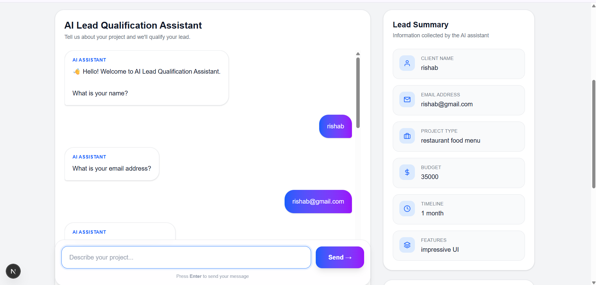

# 🚀 LeadIQ AI

An AI-powered Lead Qualification CRM that helps businesses automate lead qualification, lead scoring, proposal generation, and AI-powered follow-up emails.


## ✨ Features

- 🤖 AI Lead Qualification Assistant
- 📊 CRM Dashboard
- 📈 Lead Scoring
- 📧 AI Email Generator
- 📄 AI Proposal Generator
- 📊 Analytics Dashboard
- 🔍 Search & Filter Leads
- 📁 CSV Export
- 🔐 User Authentication
- 🌙 Dark Mode Support
- 📱 Responsive Design


## 🛠 Tech Stack

- Next.js 16
- React
- TypeScript
- Tailwind CSS
- Prisma ORM
- SQLite
- NextAuth
- Chart.js
- OpenRouter GPT-4o-mini
- React Icons


## 📸 Screenshots

### 🤖 AI Chat Assistant


### CRM Dashboard

> Add a screenshot here

### Analytics

> Add a screenshot here


## 🚀 Getting Started

Clone the repository

```bash
git clone https://github.com/YOUR_USERNAME/YOUR_REPOSITORY.git
```

Install dependencies

```bash
npm install
```

Run the development server

```bash
npm run dev
```

Open

```
http://localhost:3000
```

---

## 📌 Future Improvements

- AI Memory
- Better Lead Extraction
- Voice Assistant
- Team Workspace
- CRM Integrations
- Real-time Notifications
- Framer Motion Animations

---

## 👨‍💻 Author

**Deepak Kumar**

If you like this project, feel free to ⭐ the repository.